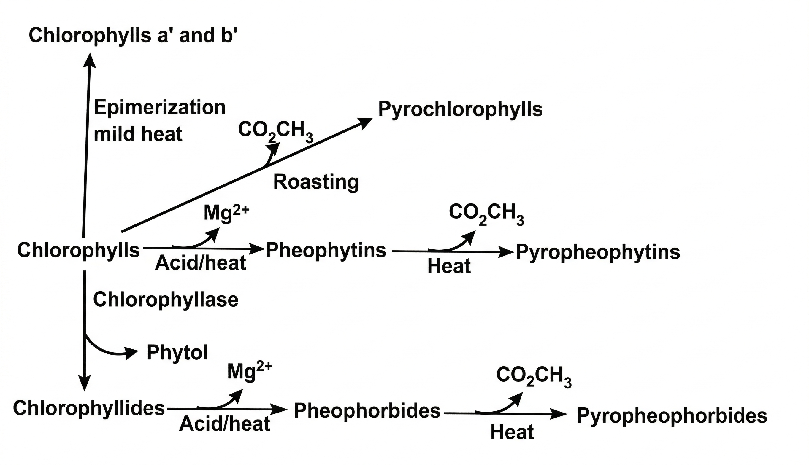
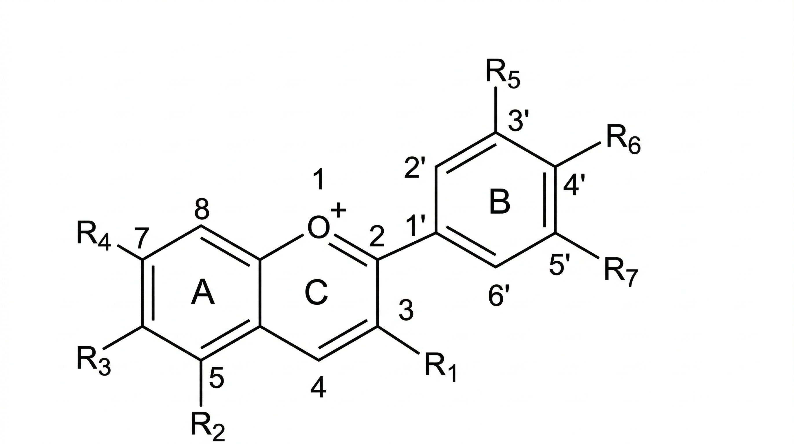
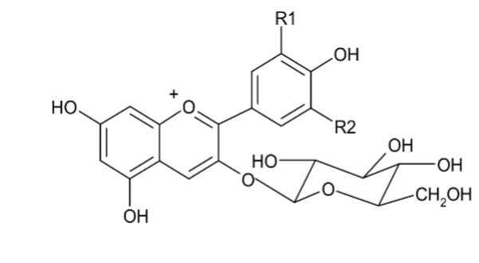
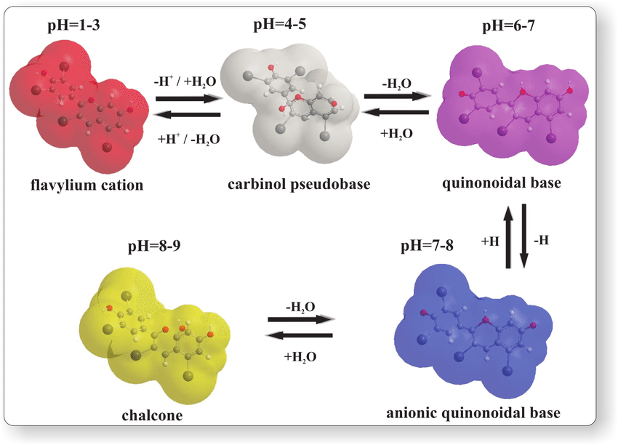
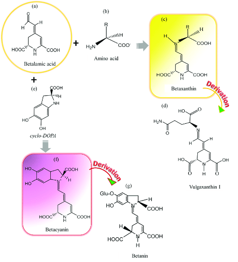
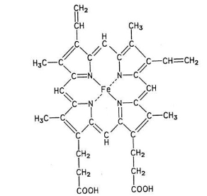

# Food Pigments and Flavours

## Food Pigments

### Introduction

- Food Pigments are naturally occurring compounds present in plants and animal tissues. They impart colour to the cells in which they exist.
- It plays a very important role in enhancing the aesthetic appearance of foods.
- Pigments are technically chemical compounds that absorb light in the wavelength range of the visible region.
- The colour produced by a pigment depends on a specific part of its molecule called the **chromophore**. When light strikes this structure, it absorbs certain wavelengths of light, causing electrons to jump to a higher energy level (excitation). The wavelengths of light that are not absorbed are reflected or refracted back; these are detected by our eyes and interpreted as colour.
- Pigments extracted from plants, animals and minerals have been widely used for imparting colour to various foods. Nowadays, use of synthetic dyes is also more common.
- Various natural pigments found in food sources include:
  - Chlorophylls
  - Myoglobin and haemoglobin
  - Anthocyanins
  - Carotenoids
  - Flavonoids
  - Tannins
  - Betalains
  - Quinones and Xanthones

### Classification of pigments

Pigments can be grouped into various categories based on their properties. The categorization can be done:

#### 1. Based on solubility

| **Solubility**                           | **Pigments**                                                       |
| ---------------------------------------- | ------------------------------------------------------------------ |
| Water soluble/Lipid insoluble/Lipophobic | Flavonoids-Anthocyanins, Flavanols, Flavones, Flavanals, Betalains |
| Water insoluble/Lipid soluble/Lipophilic | Chlorophyll, Carotenoids                                           |

#### 2. Based on source

1. Natural pigments - produced by living organisms such as plants, animals, fungi, and microorganisms.
   1. Plant origin - chlorophyll, carotene, anthocyanin, tannins, betanin, betaxanthins, etc.
   2. Animal origin - myoglobin, heamoglobin, bile pigments, etc.
2. Synthetic - obtained from laboratories. E.g. - indigo, fast green FCF, sunset yellow FCF.

#### 3. Based on chemical structure/structural characteristics

1. Tetrapyrroles - E.g. - chlorophylls and haem
2. Tetraterpenoids/isoprenoids - E.g. - carotenoids and iridoids
3. Benzopyran derivatives/oxygenated heterocyclic compounds - E.g. - anthocyanins and other flavonoid pigments
4. Quinones - benzoquinone, naphthoquinone, anthraquinone
5. N-heterocyclic compounds - E.g. - purines, pterins, flavins, phenazines, phenoxazines, and betalains

### Major classes of pigments

#### 1. Chlorophyll

- It is the **green pigment** present in plants including algae, and is involved in photosynthesis. One of the most abundant pigments in nature.
- **Water insoluble** in nature and can be extracted using organic solvents.
- Chlorophyll molecule consists of a central metal core (magnesium) surrounded by a nitrogen-containing structure, resulting in a **porphyrin** ring.
- All the chlorophyll molecules are characterized by the presence of four pyrrole-like rings (thus termed **tetrapyrroles**) along with an additional fifth ring.
- Besides, a number of side chains are attached to the ring structure, of which an important one is, the side chain of a long hydrocarbon, called **phytol** ring.
- Chlorophylls are classified as chlorins, which are close relatives of porphyrins like haemoglobin. Chlorophylls are magnesium complexes derived from porphin.
- Light absorption in chlorophyll is carried out by the porphyrin ring.
- A number of chlorophyll structures have been known. In higher plants, ferns, mosses, algae, only two chlorophylls found ("_a_" and "_b_"), and the rest of them have been found in other groups such as algae and bacteria.
- Chlorophylls _a_ and _b_ occur in approximate ratio of 3:1 in fruits and vegetables.
- Chlorophyll _a_ contains methyl group and _b_ contains formyl/aldehyde group.
- Chlorophyll _a_ appears blue-green and chlorophyll _b_ yellow-green.
- The chlorophyll molecule has a hydrophilic part, the macrocycle, and a hydrophobic segment, the phytol. The closed circuit of conjugated double bonds is the chromophore that allows them to absorb light.
- Structurally, chlorophyll _b_ is more stable than chlorophyll _a_ due to electron withdrawing effect of C-3 formyl group.

<figure>
  
  <figcaption>Figure 1:</figcaption>
</figure>

The green colour of vegetables and fruits, due to the presence of chlorophyll, is affected by aging, enzymes, weak acids, oxygen, heat, and light.

##### Effect of heat, acid, alkali and enzyme on chlorophyll

##### Effect of acid

- pH plays a vital role in stability. It is more stable in alkaline pH than acidic.
- Treatment of cholorophyll _a_ with acid removes the magnesium ion replacing it with two hydrogen atoms giving an **olive-brown** solid, **pheophytin**.
- Pheophytin-_a_ exhibits a **grey-brown colour**, whereas pheophytin-_b_ is **olive green**.
- Formation of pheophytin in processed vegetables is increased at lower tissue pH values and at higher process temperatures.
- The formation of derivatives known as **pyropheophytins** may also occur by the loss of the carbomethoxy group from pheophytins (5, 12) as a result of further heating.

##### Effect of alkali

- When treated in alkaline solution such as $NaOH$, methyl and phytyl esters are removed producing **chlorophyllin** (bright green in colour). It is water soluble causing cooking water to turn green as well.
- Chlorophyllins are compounds with a slightly higher stability compared to chlorophyll.

##### Effect of heat/cooking

- Colour first changes to bright green, because of clearance of cloudy pockets from their cells due to heating and expansion of gases. bright green colour of chloroplasts is visualized.
- As temperature rises, chemical changes lead to formation of olive green to dull green pheophytins.
- Formation of pheophytins during heating is initiated by the release of cellular acids and the synthesis of new acids.
- **Mild heat epimerization** is the first alteration observed when chlorphyll is exposed to heat. Mild heating is sufficient to form isomers designated as chlorophylls-_a'_ and _b'_.

<figure>
  
  <figcaption>Figure 2:</figcaption>
</figure>

##### Effect of enzyme

- Chlorophyllase catalyzes cleavage of phytol from chlorophylls forming **chlorophyllide (bright green)**.
- "In the presence of acid, chlorophyllides undergo the loss of magnesium to form **pheophorbides (olive brown)**.
- Chlorophyllase also hydrolyzes the phytol chain of pheophytins giving rise to pheophorbides.
- Chlorophyllase losses its activity when heated to 100 °C.
- Since the optimum temperature for chlorophyllase activity in vegetables ranges between 60 °C and 82.2 °C, some green vegetables show considerable formation of chlorophyllides and pheophorbides during low-temperature (60–70 °C) blanching treatments.

##### Ways to retain the green colour in processed foods

- Acid neutralization, high temperature short-time processing, enzymatic conversion of chlorophyll to chlorophyllide, and commercial application of metallo complex.
- Pheophytin and pyropheophytin will complex with copper and zinc ions to form complexes with more attractive green colour and are more stable to light.
- **Allomerization**: Chlorophyll oxidizes when dissolved in alcohol or other solvent and exposed to air. This process is called allomerization and the resulting products are blue green in colour.

#### 2. Flavonoids

- The name stems from the Latin word "_flavus_", which means yellow.
- Flavonoids are water-soluble phenolic compounds (having a $-OH$ group attached to an aromatic ring).
- More than 3,000 different flavonoids have been described.
- They have general structure of 15 carbons skeleton (C6C3С6).
- Most important class of pigments for flower colouration, producing yellow or red/blue pigmentation.
- On the basis of their chemical structure, these pigments are grouped in several classes:

##### Classification of Flavonoids

| **Class**        | **Examples**                                              | **Food Sources**                                                                 |
| ---------------- | --------------------------------------------------------- | -------------------------------------------------------------------------------- |
| **Flavonols**    | Quercetin, Kaempferol, Myricetin, Isorhamnetin            | Onion, Apple, Cranberries, Tea, Berries, Olives, Banana, Red Wine, Kale, Lettuce |
| **Flavonones**   | Naringenin, Hesperitin                                    | Orange, Lemon, Pineapple, Grapefruit                                             |
| **Flavanols**    | Epicatechin, Catechin, Epigallocatechin (EGC), Theaflavin | Lettuce, Blueberries, Grapes, Green Tea, Black Tea, Plums, Apples, Cranberries   |
| **Flavones**     | Apigenin, Luteolin                                        | Apple, Celery, Lemon, Parsley, Oregano, Beets                                    |
| **Anthocyanins** | Cyanidin, Delphinidin, Malvidin, Petunidin                | Blueberries, Cherries, Grapes, Raspberries, Strawberries, Cranberries            |
| **Isoflavones**  | Genistein, Diadzein, Glycitien                            | Soyabeans, Legumes                                                               |

#### 3. Anthocyanins

- The term anthocyanin is derived from the Greek words _anthos_ (flower) and _kyanos_ (dark blue).
- Anthocyanins are water-soluble pigments belonging to family of **flavonoids**.
- The colour of anthocyanin-rich fruits and vegetables vary from vivid red as in strawberry, purple as in eggplant, and dark blue as in blueberry.
- Anthocyanins are found in fruits (especially berries), vegetables, nuts, grains, roots, and flowers. Major sources are purple grapes, cherry, plum, raspberry, strawberry, blackberry, blueberry, black currant, cranberry, chokeberry, red cabbage, and red wine
- Over 500 different anthocyanins have been isolated from plants. They are all based on a single basic core structure, the **flavylium ion**.
- The flavylium ion can have different side groups at seven possible positions. These groups—typically $−H$, $−OH$, or methoxy groups ($−OCH_3$) determine the identity and properties of the resulting **anthocyanidins**.
- When **anthocyanidins are coupled to sugars, anthocyanins are formed**. As sugars can be coupled at different places and many different sugars are present in plants, it is clear that a very large range of anthocyanins can be formed. Different groups attached give different colours.

<figure>
  
  <figcaption>Figure 3: General anthocyanins structure</figcaption>
</figure>

| Name         | Abbreviation | $R_1$ | $R_2$ | $R_3$ | $R_4$ | $R_5$ | $R_6$ | $R_7$ |
| ------------ | ------------ | ----- | ----- | ----- | ----- | ----- | ----- | ----- |
| Cyanidin     | Cy           | OH    | OH    | H     | OH    | OH    | OH    | H     |
| Delphinidin  | Dp           | OH    | OH    | H     | OH    | OH    | OH    | OH    |
| Malvidin     | Mv           | OH    | OH    | H     | OH    | OMe   | OH    | OMe   |
| Pelargonidin | Pg           | OH    | OH    | H     | OH    | H     | OH    | H     |
| Peonidin     | Pn           | OH    | OH    | H     | OH    | OMe   | OH    | H     |
| Petunidin    | Pt           | OH    | OH    | H     | OH    | OMe   | OH    | OH    |

<figure>
  
  <figcaption>Figure 4: Sugar attached to anthocyanidin forming anthocyanin</figcaption>
</figure>

- Substitution of the hydroxyl and methoxyl groups affects the colour of the anthocyanins.
- An increase in the number of hydroxyl groups tends to deepen the colour to a more bluish shade. An increase in the number of methoxyl groups increases redness.
- Increased hydroxylation decreases the stability; increased methylation increases the stability of anthocyanins.
- Application of anthocyanins in foods is restricted due to their ability to participate in a number of reactions resulting in decolorisation, e.g. - reaction with ascorbic acid, hydrogen peroxide, oxygen, sulfur dioxide.
- Changes in anthocyanin during processing involve polymerization (browning) or cleavage (loss of colour).

##### Effect of heat on anthocyanins

- They are significantly lost during cooking. High temperature and direct exposure to heat results in greatest loss.
- With prolonged heat, the pigment turns into brownish-grey colour.

##### Effect of pH on anthocyanins

- The anthocyanin colour varies with change in pH. At pH 1-3, anthocyanin pigments give intense **red colour**, but becomes **colourless to purple** when the pH is between 4 and 6. It turns a **deep blue** when pH is between 7 and 8.
- Further increase in pH turn the pigment from blue to green and then to yellow. The colour changes are due to structural transformations because of change in pH.
- They are more stable at **lower pH**. Thus anthocyanins are best suited for low pH foods.

<figure>
  
  <figcaption>Figure 5 :</figcaption>
</figure>

- **Oxidation**: Presence of unsaturation makes it susceptible to oxidation changing the colour from purple to brown.
- At higher concentration of $SO_2$ i.e. 0.8-1.5%, bleaching of anthocyanins takes place.
- Some metal ions such as $Ca$, $Al$, $Fe$ and $Sn$ protect the pigment from discolouration by forming complexes.
- **Enzymes**: Like glycosidases and polyphenol oxidases hydrolyzes glycosidic linkages yielding sugars and aglycones characterized by discolouration.
- Stability is higher at lower water activity i.e. 0.63 to 0.79.
- They are also susceptible to photodegradation.

#### 4. Carotenoids

- Carotenoids are **water insoluble/lipid soluble** pigments found in all higher plants, algae, bacteria and some animals.
- Animals cannot synthesize carotenoids; their presence is due to dietary intake. E.g. - Pink salmon colour is due to carotenoids.
- It is derived from the word **‘carota’** which means carrot.
- Some 600 different carotenoids are known to occur naturally, and new carotenoids continue to be identified.
- They are responsible for **red, orange** and **yellow colours** of plants and animal foods.
- Plants such as carrots, tomato, alfalfa, vegetable oils, apricots, dark green leafy vegetables, kale, spinach, broccoli, nettle, etc. are source of carotenoids.
- They play important role in photosynthesis and photo protection in plant tissues (ability to quench and inactivate reactive $O_2$ species formed by exposure to light and air).
- Specific carotenoids (in plants) serve as precursor of abscisic acid (chemical messengers and growth regulator).
- They serve as **precursors of vitamin A**.

##### Chemical structure

- Carotenoids are lipid-soluble C40 tetraterpenoids. Majority carotenoids are derived from a 40-carbon polyene chain, which is the backbone of the molecule.
- This chain may be terminated by cyclic end-groups (rings) and may be complemented with oxygen-containing functional groups.
- Basic carotenoid structural backbone comprises of **8 isoprene** units linked covalently in either head-to-tail or tail-to-tail fashion. The 8 isoprenoids units joined in such a manner that the arrangement of isoprenoid units is reversed in the center of the molecule.

  > **Isoprene**: (2-methyl- 1,3-butadiene) ($C_5H_8$) is an unsaturated hydrocarbon. It is produced by many

  > **Tetraterpenes**: are terpenes consisting of 8 isoprene units ($C_{40}H_{64}$).
  >
  > **Tetraterpenoids**: (including many carotenoids) are tetraterpenes that presence of oxygen-containing functional groups.

- All carotenoids may be derived from the acyclic $C_{40}H_{56}$.
- Carotenoids in which the carbon skeleton has been shortened by removal of fragments from one or both ends of the usual $C_{40}$ structure are called **apocarotenoids**. Natural examples are **bixin**, the major pigment of annatto, and **crocetin**, the main colouring component of saffron.

<figure>
  
  <figcaption>Figure 6: </figcaption>
</figure>

- The carotenoids most commonly encountered in foods are $\beta$-carotene, $\alpha$-carotene, $\beta$-cryptoxanthin, lycopene, lutein, and zeaxanthin, astaxanthin, and various others.

##### Classification

Carotenoids are classified according to the structure as follows:

1. Hydrocarbon carotenoids which are known as **carotenes**. E.g. - $\beta$-carotene, Lycopene.
2. Oxygenated carotenoids which are derivatives of these hydrocarbons known as **xanthophylls**, E.g. - zeaxanthin and lutein (hydroxy), spirilloxanthin (methoxy), echinenone (oxo), and antheraxanthin (epoxy).

> **Fun Fact**: Lutein and Zeaxanthin are found in lens and retina of the eyes. They are concentrated in macula or central region of the retina, and are referred to as macular pigment.

_Some major carotenoids and their food sources_

| **Carotenoids**                                                                | **Food Source**                                                                                        |
| ------------------------------------------------------------------------------ | ------------------------------------------------------------------------------------------------------ |
| **Carotenes**                                                                  |                                                                                                        |
| **$\beta$-carotene**                                                           | Carrots, sweet potato, apricots, peaches, dark green leafy vegetables                                  |
| **Lycopene**                                                                   | Tomato, watermelon, pink fleshed guava, red peppers, pink grapefruit                                   |
| **$\alpha$-carotene**                                                          | Sweet potato, carrot, kale, spinach, lettuce, broccoli                                                 |
| **Xanthophylls**                                                               |                                                                                                        |
| **$\beta$-cryptoxanthin**                                                      | Orange-fleshed fruits, peppers, pumpkin, squash, persimmon, orange, papaya, peas, chilli               |
| **Lutein**                                                                     | Leafy and green vegetables - spinach, kale, lettuce, broccoli, corn, egg yolk, marigold                |
| **Zeaxanthin**                                                                 | Corn, some variety of squash, persimmon, spinach, egg yolk, green peas, citrus fruits, peaches, papaya |
| **Astaxanthin**                                                                | Fish and crustaceans - salmon, shrimp, trout, lobster, fish eggs, green algae                          |
| **Capsanthin**                                                                 | Peppers, paprika                                                                                       |
| **Curcumin**                                                                   | Turmeric                                                                                               |
| **Apocarotenoids**                                                             |                                                                                                        |
| **Crocin, Crocetin**                                                           | Saffron                                                                                                |
| **Bixin, Norbixin**                                                            | Annatto                                                                                                |
| **$\beta$-Apo-8´-carotenal, $\beta$-Apo-10´-carotenal, and $\beta$-citraurin** | Citrus fruits                                                                                          |

- Carotenoids are susceptible to oxidation due to their conjugated polyene chain.
- Thermal treatments of carotenoids in the presence of oxygen results in formation of volatile compounds, large non-volatile compounds, cis isomers and oxidation products.
- Exposure of carotenoids to acids produces ion pairs, which later dissociate into carotenoid carbocations.
- Oxidation of carotenoids by free radicals such as singlet oxygen leads to formation of $\beta$ carotene 5,8 – endoperoxide and $\beta$ carotene - 5,6 epoxide.

#### 5. Betalains

- Betalains are **water-soluble** nitrogen-containing pigments.
- Betalain pigments are found in red beet, cactus fruits, amaranth leaves and in some flowers.
- They are stable at pH range 3-7 but are degraded by thermal processing. Unlike anthocyanins, betalains do not change in hue in response to differences in the pH of foods and beverages.
- Consists of 2 categories:
  1. **Betacyanins: red to red-violet** pigments. Include betanin, isobetanin, amaranthine and iso-amaranthine.
  2. **Betaxanthins: yellow-orange** pigments. Include vulgaxanthin, miraxanthin, portulaxanthin, and indicaxanthin.
- **Acidic** in nature due to the presence of several carboxyl groups.
- They are immonium conjugates of betalamic acid with cyclo-dopa [cyclo-3-(3,4-dihydroxyphenylalanine)] or amino compounds.
- Each betalain is a glycoside, and consists of a sugar and a coloured portion.
- Hydrolysis of betacyanin leades to either betanidin or isobetanidin or a mixture of the two.
- Betaxanthin are present as indicaxanthin (contains amino acid proline), vulgaxanthin I and II (contains glutamic acid).

<figure>
  
  <figcaption>Figure 7: </figcaption>
</figure>

- Under mild alkaline conditions, betanin degrades to betalamic acid and cyclo-DOPSA-5 O glucoside. These products are also formed during heating of acidic betanin solution or during thermal processing of products containing beetroot, but more slowly.
- Decrease in water activity will decrease the degradation rate of betalains.

#### 6. Tannins

- Tannins are generally defined as water soluble, astringent complex phenolic substances of plant origin.
- Tannins are either hydrolyzable or condensed. **Hydrolyzable** tannins are based on gallic acid; **Condensed** tannins (are colourless), often called proanthocyanidins are based on flavonoid monomers, flavone derivatives, or quinine units.
- Tannins range in colour from **yellowish–white to light brown**.
- Bark of the oak tree and grape seeds are sources of tannins. They are found in juices squeezed from grapes, apples, and other fruits and brews from extraction of tea and coffee.
- Tannins are responsible for astringency and flavour of beverages such as tea, wine, apple cider, etc.
- Tannins react and form dark coloured complexes with metals.

#### 7. Anthoxanthins

- Anthoxanthins are white, pale yellowish, water soluble pigments found in plant’s cell sap.
- They are similar to anthocyanin, but it exists in less oxidized state as the oxygen on the central group is uncharged.
- It is actually a composite of compounds known as flavones, flavonols and flavanones.
- They contribute the cream and white colour of cauliflower, onions, white potatoes and turnips.
- Short cooking is desired. With prolonged heat, the pigment turns into a brownish grey colour.

#### 8. Quinones and Xanthones

- They are found in cell sap of flowering plants, fungi, bacteria and algae. Their colour ranges from pale yellow to black.
- Most quinones are bitter in taste. Their contribution to plant colours is minimal.
- Quinones are oxidized derivatives of aromatic compounds.
- E.g. of quinones - benzoquinones, naphthoquinones, anthraquinones.
- Compounds with complex substitutes such as naphthoquinones and anthraquinones have deep purple to black hues.

#### 8. Haem Compounds (Myoglobin)

- Haem compounds are responsible for the colour of the meat. The main pigment is **myoglobin (Mb)**. The blood pigment **heamoglobin (Hb)** is of 2nd degree importance.
- Since blood is removed by slaughter, Mb is responsible for about 90% of flesh colour.
- Myoglobin is the sarcoplasmic haem protein primarily responsible for the meat colour.
- Myoglobin stores oxygen in muscle cells and is similar to heamoglobin that stores oxygen in blood cells. The more myoglobin content meat contains, the darker red it will appear in colour.
- It is a globular protein and has a single polypeptide chain.
- Chromophore component responsible for light absorption and colour is porphyrin known as **haem**. The protein part of the molecule is known as globin.

  Mb $\rightarrow$ Globin + Haem complex

- A centrally located ‘$Fe$’ atom is complexed with 4 tetrapyrrole N-atom.

<figure>
  
  <figcaption>Figure 8: </figcaption>
</figure>

- Meat colour is determined by its states of oxidation of iron, type of ligands bound to haem and state of globin.
- Haem iron may exist in:
  1. Reduced ferrous (+2)
  2. Oxidized ferric (+3)
- Haem myoglobin has different natural colours depending on its exposure to oxygen and the chemical state of the iron.
- Freshly cut meat looks purplish. High partial pressure of $O_2$ favors **oxygenation (addition of oxygen molecule to the haem group)**, forming **Oxymyoglobin** (bright red colour).
- At no oxygen or low $O_2$ partial pressures, Deoxymyoglobin and Metmyoglobin (brownish) are favored, respectively.

<figure>
  
  <figcaption>Figure 9: </figcaption>
</figure>

- Oxidation occurs more rapidly at low pH values. Presence of trace metals ($Cu^{2+}$) promote oxidation.
- When meat is cooked, the protein moiety (globin) of myoglobin is denatured and the haem is converted chiefly to **nicotinamide hemichrome**, the entire pigment acquiring a brown hue. These changes are irreversible.

##### Reaction of myoglobin

- $H_2O_2$ (from bacterial growth) can react with $Fe^{2+}$ or $Fe^{3+}$ of haem resulting in **‘choleglobin’** (green coloured).
- In presence of $H_2S$ (from bacterial growth) and $O_2$, **sulfmyoglobin** (green coloured) can form.
- During curing, $NO$ (nitric oxide) and myoglobin react to produce **nitric oxide myoglobin** ($MbNO_2$) also known as **nitrosylmyoglobin** (bright red in colour) and is unstable. Upon heating, the more stable nitric oxide myohemochromogen (nitrosylhemochrome) forms (desired pink colour of cured meat).
- Nitrite can interact with metmyoglobin. In presence of excess nitrous acid, **nitrimyoglobin** ($NMb$) will form. Upon heating in reducing conditions, $NMb$ is converted to nitrihemin (green colour). This defect is called ‘nitrite burn’.

_Summary of various coloured compounds formed by myoglobin_

| **Reaction of Myoglobin** | **Product**            | **Colour**    | **State of Iron** |
| ------------------------- | ---------------------- | ------------- | ----------------- |
| **In absence of oxygen**  | Deoxymyoglobin         | Purplish red  | $Fe^{2+}$         |
| **In presence of oxygen** | Oxymyoglobin           | Bright red    | $Fe^{2+}$         |
| **Low levels of oxygen**  | Metmyoglobin           | Brownish      | $Fe^{3+}$         |
| **Nitrogen oxide**        | Nitric oxide myoglobin | Unstable pink | $Fe^{2+}$         |
| **Carbon monoxide**       | Carboxymyoglobin       | Red           | $Fe^{2+}$         |
| **$H_2S$**                | Sulfmyoglobin          | Green         | $Fe^{3+}$         |
| **$H_2O_2$**              | Choleglobin            | Green         | $Fe^{3+}$         |

## Food Flavours

### Introduction

- Flavor is the sensation produced by a material taken in the mouth, perceived principally by the senses of taste and smell, and also by the general pain, tactile and temperature receptors in the mouth.
- Flavor is composed of taste and odor.
- Compounds responsible for taste are generally non-volatile at room temperature. They interact with taste receptors in taste buds of tongue.
- Aroma substances are volatile compounds, perceived by odour receptor sites of smell organs i.e. olfactory tissues of nasal cavity.
- A vast number of compounds are responsible for the aroma of the food products, such as aldehydes, esters, alcohols, methyl ketones, lactones, phenolic compounds, dicarbonyls, short- and medium-chain free fatty acids and sulphur compounds

#### Classification of aroma compounds

- Based on functional group: aldehydes, ketones, alcohols, esters, phenols, terpenes, amines, sulfur based compounds etc.

| **Aroma Compound** | **Examples**                                                        | **Food Source**                                                 |
| ------------------ | ------------------------------------------------------------------- | --------------------------------------------------------------- |
| **Aldehydes**      | **Acetaldehyde (pungent)**                                          | Yoghurt, butter                                                 |
|                    | **benzaldehyde**                                                    | almond                                                          |
|                    | **Cinnamaldehyde**                                                  | Cinnamon                                                        |
|                    | **Phenylacetaldehydes (5-methyl-2-phenyl-2-hexenal)**               | Chocolate                                                       |
| **Esters**         | **Octyl acetate**                                                   | Orange                                                          |
|                    | **Ethyl acetate (Fruity)**                                          | Ripe fruits                                                     |
|                    | **Allyl hexanoate**                                                 | Pineapple                                                       |
|                    | **Ethyl butanoate** **or ethyl butyrates**                          | Strawberries                                                    |
|                    | **Pentyl acetate**                                                  | Banana                                                          |
|                    | **Methyl anthranilate**                                             | Grapes                                                          |
| **Ketones**        | **Octenone**                                                        | Mushrooms                                                       |
|                    | **Acetyl pyrroline**                                                | Fresh bread, aromatic cooked rice (such as Basmati and Jasmine) |
|                    | **2,3-butanedione (diacetyl)**                                      | Butter, Yoghurt, creamy, butterscotch                           |
|                    | **2-heptanone**                                                     | cheese, white bread, butter, beer                               |
|                    | **Acetoin**                                                         | cultured dairy products                                         |
|                    | **Methyl cyclopentenolone (or maple lactone/ cyclotene/ corylone)** | Roasted coffee, almonds and peanuts.                            |
| **Terpenes**       | **Limonene**                                                        | Orange, citrus fruits                                           |
|                    | **Menthol (terpene alcohol)**                                       | Mint                                                            |
|                    | **Carvone**                                                         | caraway                                                         |
|                    | **Nerol and Geraniol**                                              | Lemons and citrus                                               |
|                    | **Citral**                                                          | Lemon grass                                                     |
| **Amines**         | **Trimethyl amine**                                                 | Fish                                                            |
| **Alcohols**       | **furaneol**                                                        | Strawberry                                                      |
|                    | **Menthol (terpene alcohol)**                                       | Peppermint                                                      |
|                    | **1-octen-3-ol**                                                    | Mushroom                                                        |
|                    | **Geosmin**                                                         | Beetroot                                                        |
| **Phenols**        | **Thymol**                                                          | Thyme                                                           |
|                    | **Eugenol**                                                         | Clove                                                           |
| **Thiol**          | **2-Methyl-3-furanthiol**                                           | Cooked meat                                                     |
| **Sulfides**       | **Diallyl disulfide, allicin**                                      | Garlic                                                          |

### Types of flavors

#### 1. Aldehydes

- ($-CHO$) carbonyl functional group.
- Component of many fruit flavourings. Common in all types of fruits, and the longer chain aldehydes, being lipid-derived, are abundant in meats, fish and fried snacks.
- C3–C5 aldehydes (propanal, butanal and pentanal) tend to have a **chemical/malty/green** note to them that is hard to define.
- Branched chain C5 aldehydes, namely, 2- and 3-methylbutanal, found in most cooked foods as well as in fresh fruits and vegetables. They have **chemical** note.
- **Cis-3-hexenal** gives a particularly fresh note to tomatoes, pomegranate, oranges and apples as well as freshly picked coriander.
- **Acetaldehyde** is a metabolic end product during fermentation of milk to yogurt. Pure acetaldehyde possesses a **pungent** irritating odor but at dilute concentrations it gives a **pleasant fruity aroma**. Acetaldehyde imparts yogurt its characteristic green apple or nutty flavor.
- Aldehydes containing an aromatic ring- **benzaldehyde** (cherry, almond), **phenylacetaldehyde** (rose, honey) and **cinnamaldehyde** (cinnamon).
- Most ubiquitous of all aroma compounds, **Vanillin**, is aldehyde (4-hydroxy-3- methoxybenzaldehyde).
- Aldehydes very readily react with alcoholic solvents to form **acetals**. Acetals are abundant in alcoholic beverages, as well as being formed in many alcohol-based flavourings. The aroma of the acetal is often similar to that of the corresponding aldehydes, but they tend to be less potent.
- Presence of aldehydes in the **off-flavor compounds** (rancidity of foods) is well known. Aldehydes are characteristic compounds of secondary oxidation in the autoxidative process of fats, oils, lipidic foods and biological membranes.

#### 2. Ketones

- ($-C=O$) carbonyl functional group.
- The straight-chain methylketones, containing one carbonyl group in the 2-position, e.g. **2-heptanone** (found in cheese, white bread, butter, beer), impart both a **blue cheese** and a **fruity pear aroma**, whereas 3-octanone produces **earthy, mushroom** notes.
- Compounds such as **2,3-butanedione (diacetyl)** and **2,3-pentanedione** provide buttery, creamy notes in many cooked foods.
- **Diacetyl** is a diketone, derived by the fermentation of citrate present in milk and dairy mixes.
- **Diacetyl** is an important aroma compound that gives the **buttery** flavor, and contributes to the delicate, full flavor and aroma of yogurt. It is especially important for products that contain low acetaldehyde concentrations.
- Some of the more structurally complex ketones have a key role in aroma: For example, (E)-5-methyl-2-hepten4-one (**filbertone**) is a character impact compound of **hazelnuts**, 6,10-dimethylundeca-5,9-dien-2-one (**geranyl acetone**) is present in many **fruits** and imparts a **floral rose aroma** and 4-(4-hydroxyphenyl) butan-2-one (**raspberry ketone**) has been isolated from raspberries and imparts a characteristic sweet, raspberry milkshake aroma.
- The carotenoid-derived ketones such as **$\beta$-ionone** (also important in raspberries) and **$\beta$-damascenone** provide, respectively, a pippy note in orchard fruits and deep juicy notes in, for example, berries, tomatoes and apples. Both were found to give woody notes to red peppers.
- **Acetoin** is a common flavor substance in many cultured dairy products. Acetoin has a mild creamy, slightly sweet, butter-like flavor that is similar to that of diacetyl. Diacetyl combined with acetoin imparts the mild, pleasant, buttery taste, and they are critical to the rich perception of yogurt.
- **Acetone** and **2-butanone** are both contributed by milk and are volatile compounds of minor importance to flavor contribution in milk products.
- Acetone has a sweet, fruity aroma and 2-butanone contributes to the “fruity” flavor. Although each of these carbonyl compounds constitutes a recognizable aroma alone, yogurt flavor is determined by a balanced mixture.
- **Methyl Cyclopentenolone (MCP) (or maple lactone, cyclotene, and corylone)** has strong caramel aroma, can be used for flavor and sweetness enhance. It is present in foods containing sugars that have been subjected to heat, and has a cooked sugar profile with strong caramel aroma.

#### 3. Esters

- Result of reaction between carboxylic acid and alcohol.
- They are fundamental to the aroma of **most fruits**, for example, melons, apples, pineapple and strawberries.
- Ex- **ethyl acetate-** present in most ripe or ripening fruits.
- Ethyl esters are major components of fruit aroma, particularly ripe fruit where the production of ethanol has boosted their formation.
- **Ethyl butanoate or ethyl butyrates** resembles **strawberry aroma** whilst **ethyl hexanoate** is characteristic of **fresh pineapple** and more tropical fruits. The longer chain ethyl esters become soapy, cheesy and waxy.
- **3-methylbutyl acetate** is characteristic of **pear** or pear drops, **allyl hexanoate** is typically **pineapple**, cis-3-hexenyl butanoate imparts the green leafy aroma of the parent alcohol, and the C9 esters are important for melon aroma.
- Esters also contribute to the more delicate aromas found in cured ham and some cheeses.

#### 4. Terpenes and terpenoids

- Terpenes, terpenoids and sesquiterpenes are major components of essential oils and are responsible for the aroma of many fruits (particularly citrus), herbs and spices.
- They are biosynthesised in plants from units of **isoprene** ($C_5H_8$) and can be linear, cyclic or polycyclic; however, those that are responsible for odour. Tend to contain **two or three isoprene units**.
- Ex- **limonene**- has weak orangey citrus peel aroma
- $\alpha$-thujene (woody) and sabinene (citrus) are present in fruits and spices.
- Terpenoid alcohols such as **nerol** and **geraniol** (which are cis/trans isomers of each other) and **citronellol** and **linalool** (two isomers) provide delicate **lemon, rose and violet aromas**, which are abundant in herbs, spices and fruits and are essential to many flavourings.
- **Menthol** is the most familiar of terpenoids, provide **minty note**, and also activating the cold-sensitive receptors in the oral cavity to produce a **cooling effect**.
- **L-Carvone** is exists in two enantiomeric forms with different aroma properties. R-carvone smells of **spearmint** (and is extracted from Mentha spicata L.) whilst the S enantiomer accounts for 50% essential oils in **caraway seeds**.

  > Terpenes are simple hydrocarbons, while terpenoids are modified class of terpenes with different functional groups and oxidized methyl group moved or removed at various positions.

  > Terpenoids are divided depending on its carbon units – monoterpenes (2 isoprene units), sesquiterpenes (3), diterpenes (4), sesterpenes (5), triterpenes (6) and tetraterpenes (8).

#### 5. Alcohols and Phenols

- Contribution to aroma tends to be less than for the aldehydes. The straight-chain alcohols are abundant in fruits, often **increasing with maturity**.
- **Ex of alcohol**- 2-Methyl-1-propanol can be associated with brown apples and bruised fruit, **1-octen-3-ol** being a character impact compound in mushrooms, Geosmin gives a characteristic earthy, musty notes to beetroot.
- **Ex of phenols- p-cresol** are particularly phenolic and **smoky**, terpene-derived **thymol** and **eugenol** provide flavor to thyme and clove, respectively, **Vanillin**- key constituent of vanilla is a phenol with that characteristic sweet vanilla aroma with smoky undertones.

#### 6. Amines

- Simplest N-containing compounds are the amines, which are typically fishy and often impart an unpleasant ammoniacal note.
- Ex- trimethylamine in fish; phenylethylamine in chocolates, nuts, citrus fruits and vinegar.

#### 7. Lactones

- Lactones are cyclic (or intramolecular) esters that are potent aroma compounds formed from the corresponding hydroxy acid.
- They tend to impart **peachy, creamy and coconut aromas**.
- Ex- **$\gamma$-decalactone** is the major lactone in both peaches and nectarines, **Jasmine lactone** provides a floral petal-like aroma to green tea etc.

#### 8. Sulfur compounds

- Sulfur compounds are exceptionally odour-active
- **Sulfide**- Simple sulfides such as **Dimethyl sulfide** is important for fruit flavours, but also at certain concentrations gives the smell of the sea as well as sweet corn and asparagus aromas.
- Ex- **Allyl methyl sulfide** and **1-propenal sulfides** present in garlic and onion.
- Cutting or crushing of garlic clove causes allinase-mediated conversion of S-allylcysteine sulfoxide to **allicin**. Decomposition of allicin yields **diallyl sulfide (DAS), diallyl disulfide (DADS), and diallyl trisulfide (DATS)**.
- Degradation of sulfur compounds cause aroma of cooked _Brassica_ (cabbage family) and _Allium_ (onion, garlic, shallot, leek etc.) vegetables.
- **Thiols**- There are only a few compounds that impart a characteristic meaty aroma and the most common examples are **2-methyl-3-furanthiol** and **bis-(2-methyl-3-furan) disulfide**.
- **Isothiocyanates**- In cooked cauliflower, **allyl isothiocyanate** is key odorant, contributing pungent, black mustard-like notes. **Methyl thiocyanate, butyl isothiocyanate, 2-methylbutyl isothiocyanate** and sulfides have been found to be important in broccoli aroma

---

## Previous Years' Questions

### Question 1 (GATE 2024)

The unique flavor of chocolate and cocoa is due to the formation of

- (A) 5-methyl-2-phenyl-2-hexenal
- (B) Cyclotene
- (C) Furaneol
- (D) Maltol

  > Answer: (A)
  >
  > Solution:
  >
  > - **5-Methyl-2-phenyl-2-hexenal** contributes to the distinctive flavor of chocolate and cocoa. The flavour compound 5-methyl-2-phenyl-2-hexenal is a member of **phenylacetaldehydes**. This compound is naturally present in cocoa beans and is considered to be the main component responsible for their characteristic aroma. It gives a distinctive cocoa aroma with mocha undertones and this compound is excellent for adding creamy cocoa, chocolatey notes and enhancing fragrances.
  > - **Cyclotene**, also known as methyl cyclopentenolone, has a nutty, licoric e, or caramellic flavor and odor. Cyclotene is also present in peanuts and roasted products like almond and coffee. Methyl cyclopentenolone is found very widely in **nature**, especially in foods containing sugars that have been subjected to heat.
  > - **Furaneol** is a natural compound that is found in many fruits, including strawberries, pineapples, raspberries, kiwis, lychees, tomatoes, etc. It is also found in fermented products like soy sauce, soy paste, wines, and beer.
  > - **Maltol** is a polyol or sugar alcohol that is used as a sugar substitute and laxative. It is a flavor enhancer and food additive with a caramel-like taste and a burnt sugar aroma. It is naturally present in pine needles, chicory, clover, ginseng, licorice and in roasted malt - from which it gets its name.

---

### Question 2 (GATE 2021)

Choose the correct pair of pigment and their corresponding colour in plant products

- (A) Carotene- Yellow-orange- Peppers
- (B) Betanin- Purple/red- Cactus pear
- (C) Lycopene- Red- Red beets
- (D) Flavanols- Orange-red- Cauliflowers (GATE 2021)

  > Answer: (A) and (B)

---

### Question 3 (GATE 2018)

Which of the following is an oil soluble pigment present in fruits and vegetables?

- (A) Flavonoids
- (B) Carotenoids
- (C) Anthocyanins
- (D) Tannins

  > Answer: (B)

---

### Question 4 (GATE 2018)

Match the commodity in Group I with the bioactive constituent in Group II

| **Group I**  | **Group II**                |
| ------------ | --------------------------- |
| P. Ginger    | 1. Lutein                   |
| Q. Green Tea | 2. Gingerol                 |
| R. Spinach   | 3. Curcumin                 |
| S. Turmeric  | 4. Epigallocatechin gallate |

- (A) P-1, Q-2, R-3, S-4
- (B) P-2, Q-4, R-1, S-3
- (C) P-4, Q-1, R-3, S-2
- (D) P-2, Q-3, R-1, S-4

  > Answer: (B)

---

### Question 5 (GATE 2015)

Match the edible plant tissue in Group I with the type of carotenoid given in Group II.

| **Group I**   | **Group II**        |
| ------------- | ------------------- |
| P. Corn       | 1. Lycopene         |
| Q. Red pepper | 2. $\beta$-Carotene |
| R. Pumpkin    | 3. Capsanthin       |
| S. Tomato     | 4. Lutein           |

- (A) P-3, Q-4, R-2, S-1
- (B) P-2, Q-1, R-3, S-4
- (C) P-4, Q-3, R-2, S-1
- (D) P-1, Q-2, R-4, S-3

  > Answer: (C)

---

### Question 6 (GATE 2013)

When garlic is cut or processed, the crushed garlic odour is due to the formation of

- (A) diacetyl
- (B) diallyl disulfide
- (C) ethyl butyrate
- (D) benzaldehyde

  > Answer: (B)

---

### Question 7 (GATE 2011)

Match the food items and their principal flavouring agents given in the two columns below

|           |             |
| --------- | ----------- |
| P. Butter | 1. Menthol  |
| Q. Orange | 2. Limonene |
| R. Cloves | 3. Eugenol  |
| S. Mint   | 4. Diacetyl |

- (A) P-3, Q-2, R-4, S-1
- (B) P-2, Q-3, R-1, S-4
- (C) P-4, Q-1, R-3, S-2
- (D) P-4, Q-2, R-3, S-1

  > Answer: (D)

---

### Question 8 (GATE 2009)

Match the items in Group I with the most appropriate items in Group II

| **Group I**   | **Group II**      |
| ------------- | ----------------- |
| P. Tocopherol | 1. Oxygen binding |
| Q. Myoglobin  | 2. Yellow pigment |
| R. Crocetin   | 3. Antioxidant    |
| S. Catechin   | 4. Green pigment  |
|               | 5. Tanning agent  |

- (A) P-3, Q-1, R-2, S-5
- (B) P-1, Q-3, R-4, S-5
- (C) P-3, Q-1, R-5, S-2
- (D) P-1, Q-3, R-5, S-4

  > Answer: (A)
